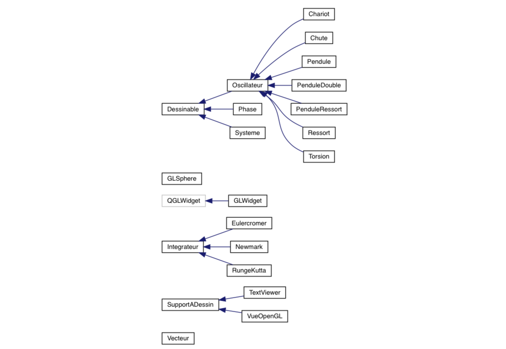

# Conception

## Justifications
* **Dessinable**: Super-classe abstraite fournissant les méthodes utilisés pour le dessin. Est héritée par toutes les classes que l'on veut dessiner.
* **Oscillateur**: Classe abstraite fournissant les méthodes et attributs que doivent posséder chaque oscillateur. Est hérité par tous les oscillateurs. Hérite de dessinable, ainsi, tous les oscillateurs se doivent d'être dessinable.
* **Chariot**: Oscillateur  simulant un chariot duquel est accroché un pendule.
* **Chute**: Oscillateur simulant une chute libre sans frottement.
* **Pendule**: Oscillateur simulant un pendule simple avec frottements.
* **PenduleDouble**: Oscillateur couplé simulant un double pendule sans frottements.
* **PenduleRessort**: Oscillateur simulant un pendule-ressort sans frottements.
* **Ressort**: Oscillateur simulant un ressort avec frottements.
* **Torsion**: Oscillateur simulant un pendule de torsion avec frottements.
* **Phase**: Classe décrivant les espaces de phases. Est dessinable. Oscillateur contient un pointeur sur une phase. Ainsi, lorsque l'on veut se concentrer sur l'espace de phase d'un oscillateur, il suffit de lier cet Phase à cet oscillateur.
* **Systeme**: Classe regroupant l'ensemble des oscillateurs. Hérite de dessinable et permet nottament de dessiner facilement un lot d'oscillateur.
* **GLSphere**: Classe décrivant les sphères pour OpenGL.
* **GLWidget**: Classe héritant de la classe QGLWidget de la bibliothèque de Qt. S'occupe de la gestion de la fenêtre et du contenu avec Qt et OpenGL.
* **Intégrateur**: Super-classe abstraite fournissant la méthode générique d'évolution qui doit être implémenté par un Intégrateur.
* **Eulercromer**: Intégrateur implémentant la méthode de Euler-Cromer.
* **Newmark**: Intégrateur implémentant la méthode de Newmark.
* **RungeKutta**: Intégrateur implémentant la méthode de Runge-Kutta à l'ordre 4.
* **SupportADessin**: Super-classe abstraite regroupant l'ensemble des méthodes de dessin du projet. Décrit la manière donc un SupportADessin doit se comporter.
* **TextViewer**: SupportADessin en mode textuelle. Dessine le projet sur le terminal, en mode textuel.
* **VueOpenGL**: SupportADessin en mode visuel. Dessine le projet dans un fenêtre Qt, avec une surcouche OpenGL.
* **Vecteur**: Classe regroupant l'implémentation de vecteur à dimensions n.

Pour de plus amples informations, réfèrez-vous à la documentation générée à l'aide de Doxygen. (Voir le README sur les informations quant à la génération de cette documentation)
