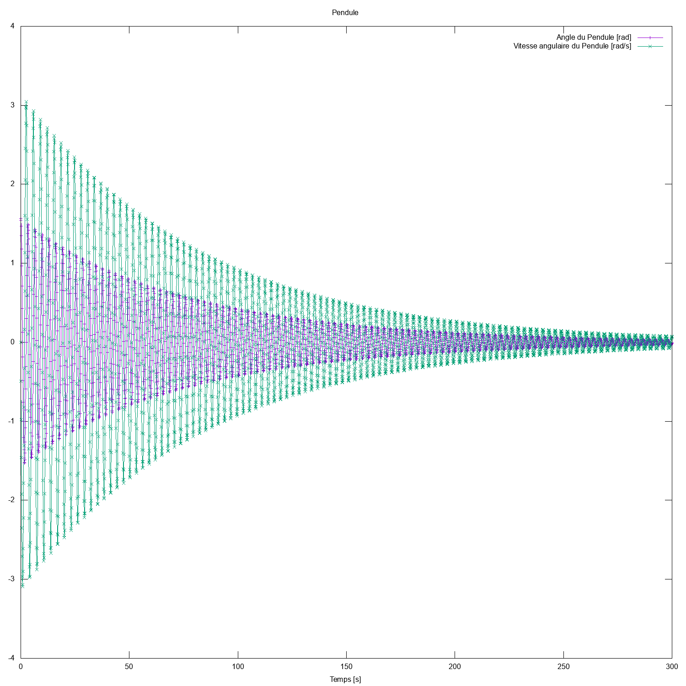
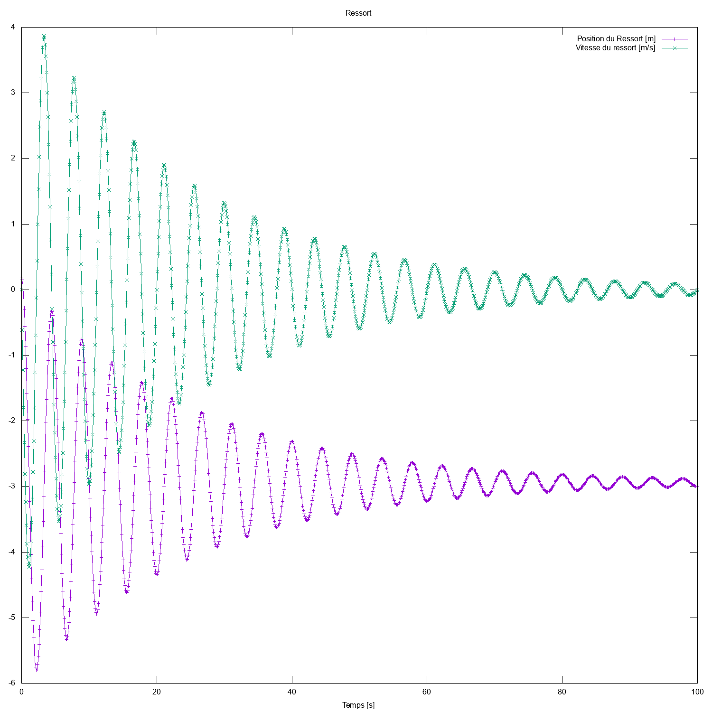
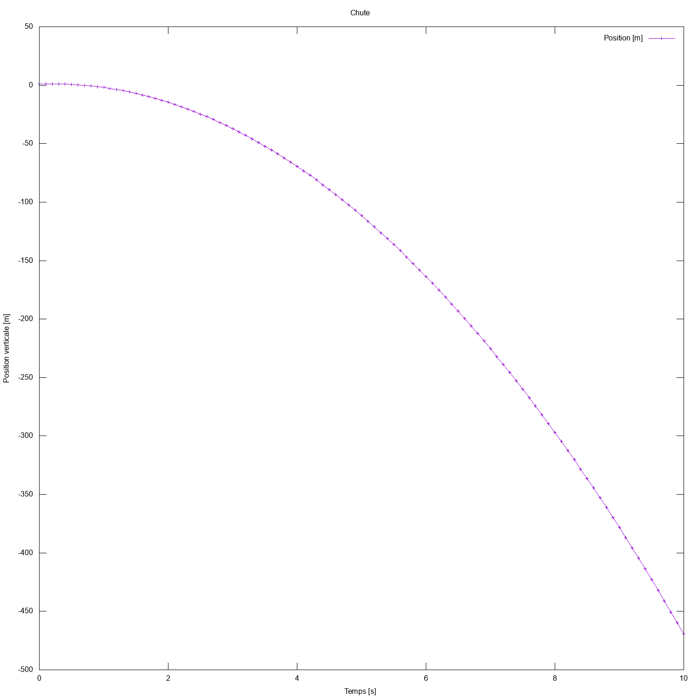
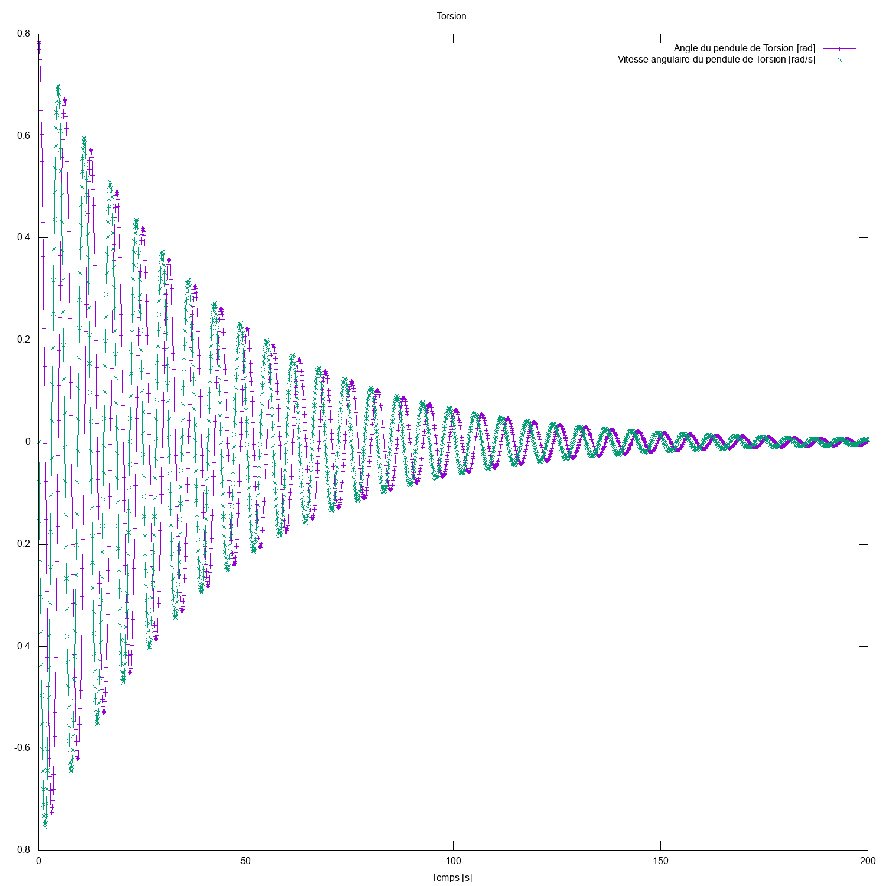
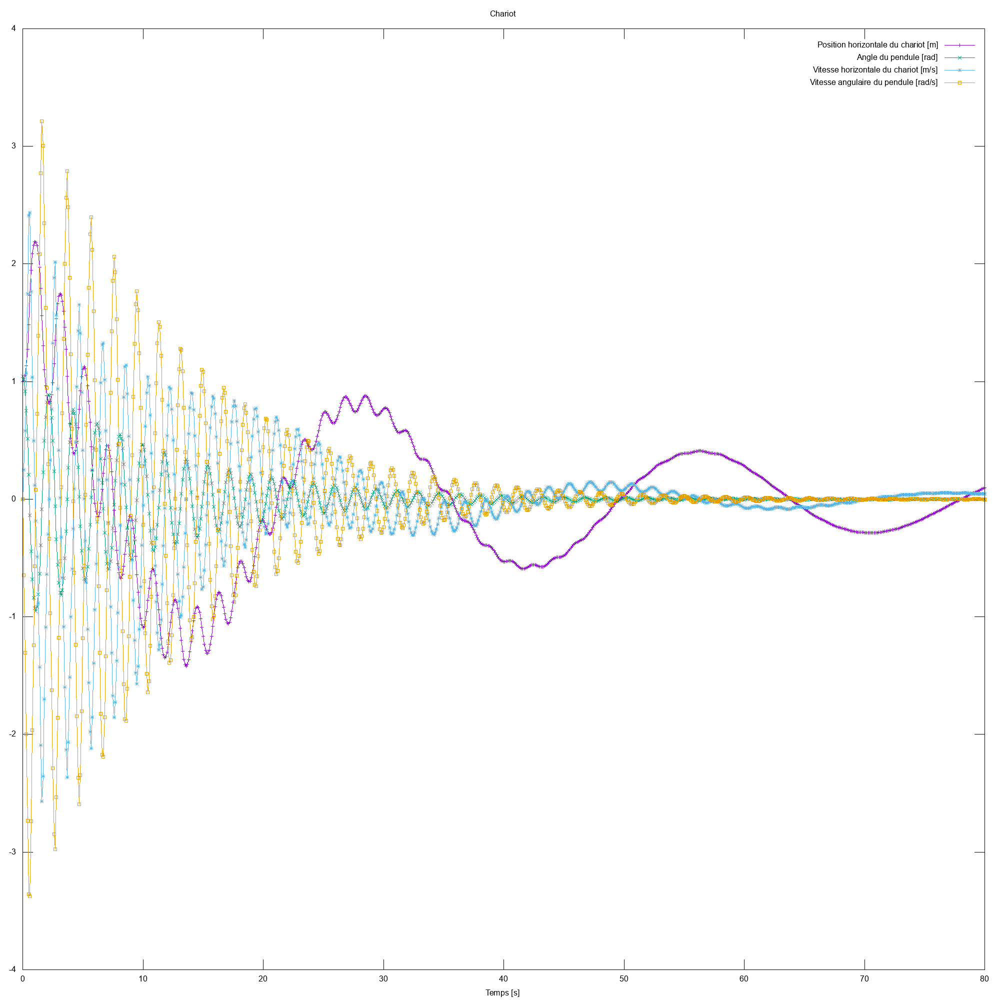
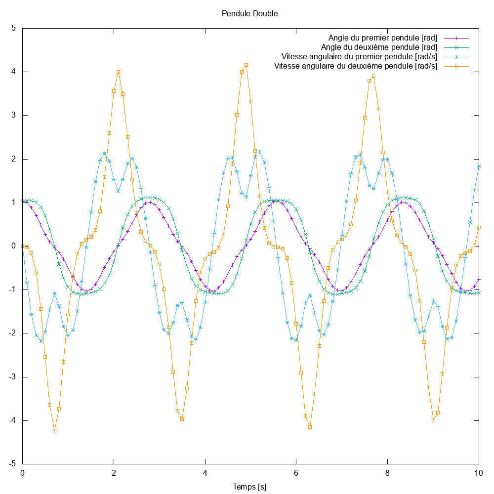
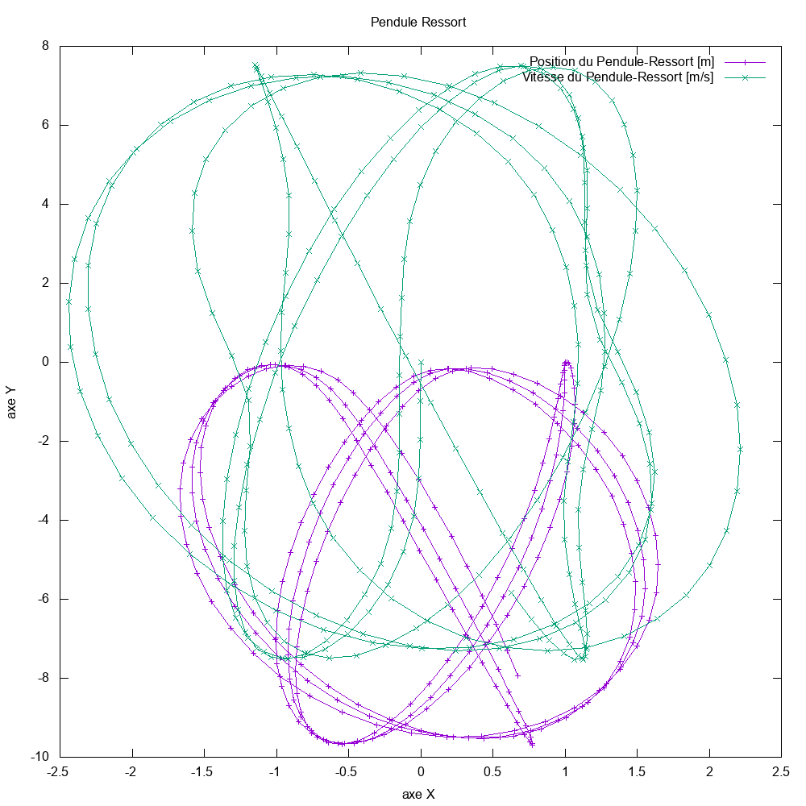

<!-- Ce document est en format Markdown, et utilise latex pour le rendu de quelques éléments. Pour le lire, veuillez vous procurer un bon lecteur markdown, ou de lire le PDF associé. -->

# Oscillateurs couplés

Bienvenue dans ce projet d'informatique du Bachelor 2 à l'EPFL, en section physique.

Projet réalisé par **Delphine Martres** et **Damien Korber**.

## Préambule
### Informations concernant le projet.
> _Jusqu'où avez-vous été ? qu'est-ce que vous avez fait/pas fait ?_

Nous avons été jusqu'au bout du projet, c'est-à-dire **jusqu'à P13 compris**.

Nous avons réalisé l'**ensemble des oscillateurs** du complément mathématique, à l'exceptions des pendules reliés par un ressort et l'oscillateur DeuxRessort, dû à un manque de temps. Une analyse des oscillateurs implémentés est disponible plus bas.

Nous avons implémenté **tous les intégrateurs** énoncés dans le complément mathématique, c-à-d Euler-Cromer, Newmark et Runge-Kutta d'ordre 4. Un comparatif est disponible plus bas.

Nous avons également un **espace des phases fonctionnel**. Cependant, changer l'oscillateur doit se faire **manuellement**. Nous avons pas eu le temps d'implémenter une touche de changement d'oscillateur.

> _Avez-vous une version graphique ? Si oui, avec quelle bibliothèque graphique (Qt (quelle version ?), WxWidget, SDL, Glut, autre [précisez]) ?_

Oui, nous avons une version graphique.

Nous utilisons **qmake 3.1** et **Qt 5.10** pour ce projet. Le programme fonctionne peut-être avec d'autres version, mais nous n'avons pas testé.
De plus, nous avons testé le programme sur les OS suivants:

- **MacOS 10.13.4**
- **Kubuntu 16.04**
- **Machine virtuelle de l'EPFL (25 mai)**

> _Combien d'heures en moyenne par personne estimez vous avoir passé par semaine sur le projet ? (essayez d'être objectif : n'oubliez pas qu'au début vous n'avez peut être pas fait grand chose, comptez sur 14 semaines, i.e. la première semaine incluse, ne comptez pas le cours ni les exercices hors projet, n'oubliez pas de diviser le total par 2 car je veux une estimation moyenne par personne.)_

Nous estimons, en moyenne et par personne, une implication d'une petite dizaine d'heures par semaine. Cependant, nous avons fait attention à ne pas prendre trop de temps sur les autres branches. Ainsi, nous avons essentiellement travaillé sur nos temps libres (soirs du week-end et vendredi dès midi essentiellement).

### Les quelques points intéressants du projet.
**La simulation visuelle**

Le point central de ce projet est évidemment la simulation visuelle. Nous vous proposons de compiler et executer le programme dans Qt_GL. Quand vous y êtes, vous pouvez vous balader dans l'espace et admirer les oscillateurs. Un petit point supplémentaire, un ressort est étiré ou le support du pendule de torsion est tendu, plus le fil devient rouge.

**L'espace des phases**

Lors de l'execution de la version graphique du projet, l'espace des phases peut-être affiché en appuyant sur **P**. On peut donc y voir une représentation de la vitesse en fonction du temps de l'oscillateur sélectionné. Pour changer d'oscillateur dessiné, rien de plus simple ! Il suffit d'appuyer sur **O**, et un nouvel oscillateur est dessiné. Remarquez qu'il commence à dessiner l'espace de phase là au moment ou vous avez cliqué. En effet, nous n'avons qu'un espace de phase à la fois. Lors d'un changement d'oscillateur, nous remettons à 0 les positions conservées dans la phase. Pour changer l'oscillateur dessiné par défaut, suivre les instructions se trouvant dans la fonction `GLWidget::initSys()`.

**La boussole**

Il est très facile de se perdre dans la simulation visuelle. Du coup, nous avons implémenté une boussole directement sur Qt. Nous en sommes fière, parce que c'était pas facile à faire. Par défaut, elle devrait être activée. Mais si ce n'est pas le cas, ou si vous voulez desactiver cette boussole, appuyez sur la touche **B**. Elle suivre vos mouvements dans l'espace.

**Le changement de point de vue**

Nous n'étions pas d'accord sur la façon de se déplacer dans l'espace. Nous avons donc implémenté un toggle permetant de switcher entre une vue à la première personne (on "est" la caméra) et une vue à la troisième personne (on fixe un point dans l'espace). Pour changer de point de vue, appuyez sur **V**.

**Le changement d'intégrateur en cours d'execution**

Dans la simulation graphique, il est possible de changer d'intégrateur en cours d'execution. Par défaut, l'intégrateur de Runge-Kutta d'ordre 4 est utilisé, mais vous pouvez switcher d'intégrateur en cours de route. Pour cela, appuyez sur:

* **1** - pour utiliser Euler-Cromer;

* **2** - pour utiliser Newmark;

* **3** - pour utiliser Runge-Kutta d'ordre 4.

Un message indiquant un changement d'intégrateur sera affiché dans le terminal.

**Remarque:** le texte affiché après est l'adresse de l'intégrateur actuel.

**La documentation**

Pour ne pas se perdre dans le projet, nous avons utilisé **Doxygen** pour générér la documentation automatiquement. Pour plus d'informations à ce sujet, se référer à la section "Générer la documentation".

**Le mode debug**

Pour vérifier le bon fonctionnement des oscillateurs executé durant la simulation visuelle, nous avons implémenter un mode debug. Lors de l'execution, appuyez sur **§** pour (dés)activer le mode debug. Les informations s'afficheront dans le terminal.


## Table des matières
<!-- TOC depthFrom:2 depthTo:6 withLinks:0 updateOnSave:1 orderedList:1 -->

1. Préambule
	1. Informations concernant le projet.
	2. Les quelques points intéressants du projet.
2. Table des matières
3. Introduction
4. Guide de compilation
	1. Ce qui est compilable
	2. Compiler sur MacOS et Linux
	3. Compiler tous les sous-projet fonctionnels
	4. Générer la documentation
5. Guide d'utilisation
	1. Les touches.
6. Analyse
	1. Les intégrateurs
	2. Les oscillateurs
		1. Le pendule simple
		2. Le ressort simple
		3. La chute
		4. Le pendule de torsion
		5. Le chariot
		6. Le pendule double non amorti.
		7. Le Pendule-Ressort non amorti.

<!-- /TOC -->

\pagebreak
## Introduction

Le but de ce projet est la réalisation d'un programme pouvant simuler des oscillateurs couplés. Nous avons réalisé quelques preset d'oscillateurs, mais le programme se veut suffisament souple pour ajouter de nouveaux oscillateurs.

Nous offrons une simulation textuelle, ainsi qu'une simulation visuelle, utilisant Qt et OpenGL.

\pagebreak
## Guide de compilation

Pour compiler le programme dans sa version actuelle, rien de plus simple, suivez ce tutoriel et tout devrait bien se passer.

### Ce qui est compilable

Nous avons plusieurs parties du projet qui compilent.

**La simulation visuelle**

Elle se trouve dans `exerciceP10/Qt_GL/` et est fonctionnelle.

**La simulation textuelle**

Elle se trouve dans `exerciceP10/text/` et est fonctionnelle.

**Les fichiers tests**

La plupart des fichiers tests ne fonctionnent plus, car ils sont trop vieux, et que nous les avons pas actualisés. Néanmoins, il reste deux tests qui compilent encore. Il s'agit de **phase** (`exerciceP10/general/phase/`) et de **vecteur** (`exerciceP10/general/vecteur/`).

### Compiler sur MacOS et Linux

Pour compiler sur MacOS et Linux, il suffit de se rendre à la racine du projet, et de faire ces commandes.

```bash
qmake # Génère un Makefile permetant de compiler le projet.
make # Compile le projet en suivant les instructions du Makefile.
```

Ainsi, on compile tout ce qui est fonctionnel dans ce projet.

**Remarque**: Il est possible de se rendre dans chaque dossiers fonctionnels, et d'y executer ces commandes. Ainsi, on peut compiler les projets séparéments.

Pour exécuter ce qu'on vient de compiler, il suffit de se rendre dans le dossier de ce qu'on veut tester (c.f. Voir "Ce qui est compilable") et lancer la commande:

```bash
./$NOM_DE_EXECUTABLE # Lance l'executable demandé.
```

où `$NOM_DE_EXECUTABLE` est le... nom de l'executable.


### Générer la documentation

La documentation est générée automatiquement par **Doxygen**.

**Génération et lecture**

Pour générer la documentation, allez à la racine du projet (là où se trouve le README), et executez cette commande:  `doxygen doxyfile`.

La documentation ainsi générée se trouve dans `docs/`. Pour la documentation html, ouvrez `docs/html/index.html`. Pour la documentation en latex, executez `make` dans le dossier `docs/latex`.

**Remarque:** la documentation en latex n'est ni maintenue, ni testée.


\pagebreak
## Guide d'utilisation

Dans cette section, nous vous expliquons comment utiliser ce projet. Concernant la simulation textuelle, il n'y a rien à savoir, donc nous nous intéressons à la simulation visuelle.

**Remarque:** Ce programme est adapté pour un **clavier Suisse**, c'est à dire un clavier **QWERTZ**.

### Les touches.

**Déplacements**

| Action                                              | Touche associée                   |
|:---------------------------------------------------:|:---------------------------------:|
| Avancer                                             | **w** ou **pageUp**               |
| Reculer                                             | **s** ou **pageDown**             |
| Translater sur la droite                            | **d**                             |
| Translater sur la gauche                            | **a**                             |
| Appliquer une rotation dans le sens trigonométrique | **q**                             |
| Appliquer une rotation dans le sens horaire         | **e**                             |
| Translater vers le haut                             | **r**                             |
| Translater vers le bas                              | **f**                             |
| Tourner vers la droite                              | $\rightarrow$ ou (click + souris) |
| Tourner vers la gauche                              | $\leftarrow$ ou (click + souris)  |
| Tourner vers le haut                                | $\uparrow$ ou (click + souris)    |
| Tourner vers le bas                                 | $\downarrow$ ou (click + souris)  |
| Réinitialiser à la position originale               | **home** ou **h**                 |

**Autres commandes.**

| Action                                                | Touche associée |
|:-----------------------------------------------------:|:---------------:|
| (Des)activation de la boussole                        | **b**           |
| (Des)activation du mode debug dans le terminal        | **§**           |
| (Des)activation de la mise en pause de la simulation  | **space**       |
| Changement de la vue (première ou troisième personne) | **v**           |
| Activation de l'intégrateur d'Euler-Cromer            | **1**           |
| Activation de l'intégrateur de Newmark                | **2**           |
| Activation de l'intégrateur de Runge-Kutta d'ordre 4  | **3**           |
| (Des)activation de l'espace de phase									| **p**						|
| Dessine l'oscillateur suivant dans l'espace des phases| **o**						|

\pagebreak
## Analyse

Nous avons effectué quelques petites analyse de nos différentes implémentations.

### Les intégrateurs

Nous avons implémentés les trois intégrateurs proposés. L'intégrateur d'Euler-Cromer, de Newmark, et de Runge-Kutta à l'ordre 4. Nous avons donc testé une chute libre de conditions initiales $\vec{P} = (0, 1)$ et $\dot{\vec{P}} = (1, 2)$. 

Nous remarquons que, effectivement, l'intégrateur d'Euler-Cromer est moins bon que les autres. Il est certes plus simple à implémenter, mais il est bien moins précis.

De plus, nous notons que l'intégrateur de Newmark et l'intégrateur de Runge-Kutta d'ordre 4 ont quasiment la même précision ! Sur le graph, ils sont confondus.

### Les oscillateurs

Nous avons implémenté un certaine nombre d'oscillateurs, et nous avons effectué quelques teste pour voir leur bon fonctionnement.

Tous les tests ci-dessus sont effectué avec l'intégrateur de **Runge-Kutta d'ordre 4**.

\pagebreak
#### Le pendule simple

**Conditions initiales**

- Masse = 1
- Longueur = 2
- Viscosité = 0.1
- Position = {M_PI/2}
- Vitesse = {0.0}
- Origine = {0.0, 0.0, 0.0}
- Direction principale = {1.0, 0.0, 0.0}

**Schéma**


Nous remarquons que l'évolution du pendule se passe comme prévu. Il est amorti et tend vers un minimum.

\pagebreak

#### Le ressort simple

**Conditions initiales**

- Masse = 0.25
- Elasticité = 0.5
- Viscosité = 0.02
- Position = {0.18}
- Vitesse = {0.0}
- Origine = {0.0, 0.0, 0.0}
- Direction principale = {0.8, 0.0, 0.6}

**Schéma**



Nous remarquons que l'évolution du ressort se passe comme prévu. Il est amorti et tend vers un minimum.

\pagebreak

#### La chute

**Conditions initiales**

- Masse = 1
- Position = {0.0, 1.0}
- Vitesse = {1.0, 2.0}
- Origine = {0.0, 1.0}
- Direction principale = {0.0, 1.0}

**Schéma**


Nous remarquons que l'évolution de la chute se passe comme prévu. Elle continue à chuter à accélération constante.

\pagebreak

#### Le pendule de torsion

**Conditions initiales**

- Moment d'inertie = 1
- Constante de torsion = 1
- Friction = 0.05
- Position = {M_PI/4}
- Vitesse = {0.0}
- Origine = {0.0, 0.0, 0.0}
- Direction principale = {1.0, 0.0, 0.0}

**Schéma**


Nous remarquons que l'évolution du pendule de torsion se passe comme prévu. Il est amorti et tend vers un minimum.

\pagebreak

#### Le chariot

**Conditions initiales**

- Masse du chariot = 1
- Masse du pendule = 1
- Longeur du pendule = 1.5
- Elasticité = 0.1
- Viscosité du chariot = 0.1
- Viscosité du pendule = 0.1
- Position = {1.0, M_PI/3}
- Vitesse = {0.0, 0.0}
- Origine = {0.0, 0.0, 0.0}
- Direction principale = {1.0, 0.0, 0.0}

**Schéma**


Nous remarquons que l'évolution du chariot se passe comme prévu. Il est amorti et tend vers un minimum.

\pagebreak

#### Le pendule double non amorti.

**Conditions initiales**

- Masse 1 = 1
- Masse 2 = 1
- Longeur 1 = 1.5
- Longeur 2 = 0.1
- Position = {M_PI/3, M_PI/3}
- Vitesse = {0.0, 0.0}
- Origine = {0.0, 0.0, 0.0}

**Schéma**


Nous remarquons que l'évolution du pendule double non amorti se passe comme prévu. Comme il n'est pas ralenti, il continue à l'infinie et est plus ou moins périodique.

\pagebreak
#### Le Pendule-Ressort non amorti.

**Conditions initiales**

- Masse = 2
- Longeur = 1
- Raideur = 5
- Position = {1.0, 0.0}
- Vitesse = {0.0, 0.0}
- Origine = {0.0, 0.0, 0.0}

**Schéma**


Nous remarquons que l'évolution du pendule-ressort non-amorti semble se passer comme prévu.
