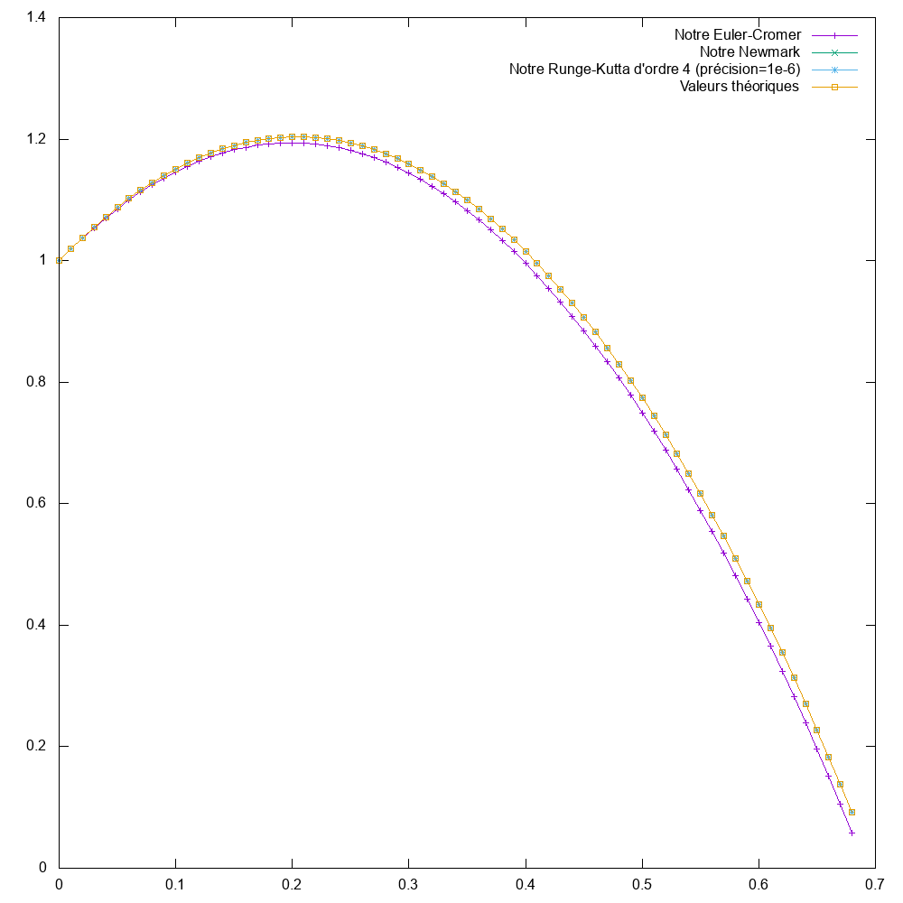

<!-- Ce document est en format Markdown, et utilise latex pour le rendu de quelques éléments. Pour le lire, veuillez vous procurer un bon lecteur, ou de lire le PDF associé. -->

# Oscillateurs couplés
Bienvenue dans ce projet d'informatique du Bachelor 2 à l'EPFL, en section physique.

Projet réalisé par **Delphine Martres** et **Damien Korber**.

### Table des matières
1. [Introduction](#intro)
2. [Guide de compilation](#compile)
3. [Guide d'utilisation](#util)
4. [Analyse](#analyse)


### 1. Introduction <a name="intro"/>
Le but de ce projet est la réalisation d'un programme pouvant simuler des oscillateurs couplés. Nous avons réalisé quelques preset d'oscillateurs, mais le programme se veut suffisament souple pour ajouter de nouveaux oscillateurs.

Nous offrons une simulation textuelle, ainsi qu'une simulation visuelle, utilisant Qt et OpenGL.

### 2. Guide de compilation <a name="compile"/>
Pour compiler le programme dans sa version actuelle, rien de plus simple, suivez ce tutoriel et tout devrait bien se passer.
#### 2.1 Préambule - les informations importantes
Nous utilisons **qmake 3.1** et **Qt 5.10** pour ce projet. Le programme fonctionne peut-être avec d'autres version, mais nous n'avons pas testé.
De plus, nous avons testé le programme sur les OS suivants:
* **MacOS 10.13.4**
* Une des dernières version de **Kubuntu**

#### 2.2 Ce qui est compilable
Comme dit précédemment, nous avons implémenté deux simulations, qui sont séparée dans deux dossiers.
##### La simulation textuelle
Elle se trouve dans `exerciceP10/text/`.
##### La simulation visuelle
Elle se trouve dans `exerciceP10/Qt_GL/`.

Concernant le reste des sous-projets (les tests, ...) vous pouvez tester des les compiler, mais la plus part ne sont plus fonctionnel dans l'état actuel du projet. Cependant, ils étaient bel et bien fonctionnels lorsqu'ils nous étaient utile.

#### 2.3 Compiler sur MacOS
Pour compiler sur MacOS, il suffit de se rendre dans le projet que l'on veut compiler, et de faire ces commandes.
```bash
qmake # permet de générer un Makefile
make # compile le projet demandé
```
Pour executer, il suffit tout simplement d'executer
```bash
./$NOM_DE_EXECUTABLE # execute la simulation
```
où NOM_DE_EXECUTABLE est le... nom de l'executable.
#### 2.4 Compiler sur Kubuntu (et donc Linux)
Pour compiler sur linux, il suffit de se rendre dans le projet que l'on veut compiler, et de faire ces commandes.
```bash
qmake # permet de générer un Makefile
make # compile le projet demandé
```
Pour executer, il suffit tout simplement d'executer
```bash
./$NOM_DE_EXECUTABLE # execute la simulation
```
où `NOM_DE_EXECUTABLE` est le... nom de l'executable.

#### 2.5 Compiler tous les sous-projet fonctionnels
A REMPLIR, MAIS CE N'EST PAS ENCORE PRET DANS LE CODE.

### 3. Guide d'utilisation <a name="util"/>
Dans cette section, nous vous expliquons comment utiliser ce projet. Concernant la simulation textuelle, il n'y a rien à savoir, donc nous nous intéressons à la simulation visuelle.

Remarque: Ce programme est adapté pour un clavier Suisse, c'est à dire un clavier QWERTZ.

#### 3.1 Les touches.
##### Déplacements
| Action | Touche associée|
| :---: | :---: |
| Avancer | **w** ou **pageUp** |
| Reculer | **s** ou **pageDown** |
| Translater sur la droite | **d** |
| Translater sur la gauche | **a** |
| Appliquer une rotation dans le sens trigonométrique | **q** |
| Appliquer une rotation dans le sens horaire | **e** |
| Translater vers le haut | **r** |
| Translater vers le bas | **f** |
| Tourner vers la droite | $\rightarrow$ ou (click + souris) |
| Tourner vers la gauche | $\leftarrow$ ou (click + souris) |
| Tourner vers le haut | $\uparrow$ ou (click + souris) |
| Tourner vers le bas | $\downarrow$ ou (click + souris) |
| Réinitialiser à la position originale | **home** |
EST-CE QUE LA TOUCHE "HOME" MARCHE VRAIMENT ?

##### Autres commandes.
| Action | Touche associée|
| :---: | :---: |
| (Des)activation de la boussole | **b** |
| (Des)activation du mode debug dans le terminal | **§** |
| (Des)activation de la mise en pause de la simulation | **space** |
| Changement de la vue (première ou troisième personne) | **v** |
| Activation de l'intégrateur d'Euler-Cromer | **1** |
| Activation de l'intégrateur de Newmark | **2** |
| Activation de l'intégrateur de Runge-Kutta d'ordre 4| **3** |

### 4. Analyse <a name="analyse"/>
Nous avons effectué quelques petites analyse de nos différentes implémentations.
#### 4.1 Les intégrateurs
Nous avons implémentés les trois intégrateurs proposés. L'intégrateur d'Euler-Cromer, de Newmark, et de Runge-Kutta à l'ordre 4. Nous avons donc testé une chute libre de conditions initiales $\vec{P} = (0, 1)$ et $\dot{\vec{P}} = (1, 2)$. 
Remarque:
* l'intégrateur de Newmark a une précision de 1e-6 dans cet exemple.
* DIRE QQCH SUR LES AXES


# ANCIENNE VERSION QUI SERA SUPPRIMEE POUR LE RENDU

## Table des matières
1. [Compilation](#compilation)
2. [Utilisation](#utilisation)
3. [Structure du projet](#structure)
4. [Conventions - A SUPPRIMER POUR LE RENDU !](#conventions)

## Compilation <a name="compilation"/>
### Compiler le projet dans son ensemble
Pour compiler le projet ou les tests qui sont encore compilable, il suffit d'exécuter ces commandes.
```bash
qmake # ou qmake-qt5 dans certaines distributions. Génère le Makefile. Attention, il faut utiliser Qt5 !
make # Compile le projet ou les tests.
```

### (Bonus) La documentation
La documentation du projet peut être générée avec Doxygen. Pour ce faire, rien de plus simple !

Il suffit de se rendre à la racine du projet et d'executer `doxygen doxyfile`.

La documentation ainsi générée se trouve dans le dossier `docs/`.

## Utilisation <a name="utilisation"/>
A REMPLIR

## Structure du projet <a name="structure"/>
L'organisation du projet suit une certaine structure, que voici.
```bash
> Asked/ # contient tous les fichiers demandés pour l'avancement du projet, et la partie administrative.
> docs/ # contient toute la documentation liée au projet (généré automatiquement avec doxygen).
```

## Conventions (À supprimer pour le rendu) <a name="conventions"/>
Quelques conventions sont respectées dans ce projet.
### Les commentaires.
Pour garder le code lisible, il est utile d'avoir certaines conventions, et comme un exemple est plus parlant qu'un long texte, voici ce qui devrait être pratiqué.

```c++
/*!
* Brève explication de son intéret.
* Un exemple de son fonctionnement si besoin
*
* Problèmes liés à cette fonction si besoin
*
* Il est fortement conseillé d'écrire sur plusieurs lignes, afin de garder
* un semblant de lisibilité. De plus, il est préférable de mettre les commentaires
* globaux de cette méthode dans ce commentaire plutôt que le long du code.
* Préférer les commentaire en une ligne pour le reste du code.
*/
//! Un commentaire d'une ligne avant la fonction (si besoin).
void Classe::Methode()
{
    double attribut(42); //<! un commentaire d'une ligne après la fonction (si besoin)
}
```
