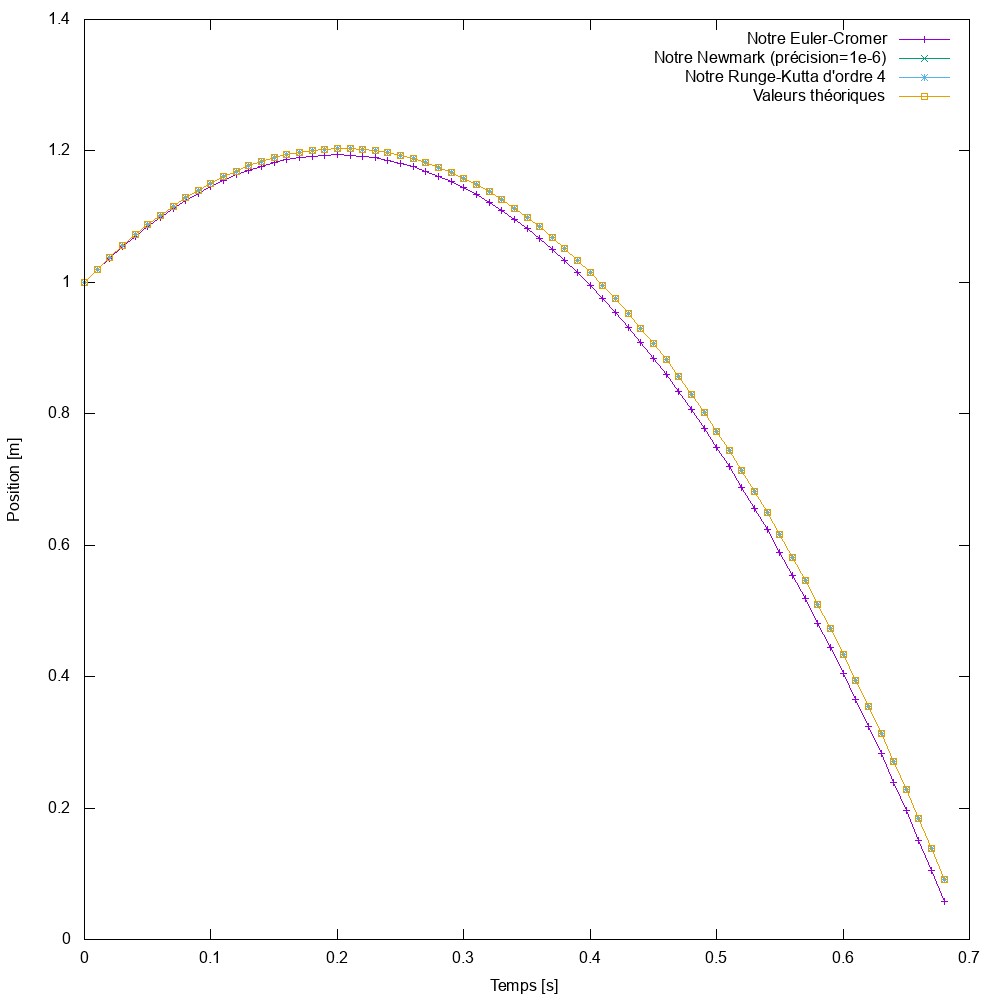

# Oscillateurs couplés
Bienvenue dans ce projet d'informatique du Bachelor 2 à l'EPFL, en section physique.

Projet réalisé par **Delphine Martres** et **Damien Korber**.

### Table des matières
1. [Introduction](#intro)
2. [Guide de compilation](#compile)
3. [Guide d'utilisation](#util)
4. [Analyse](#analyse)


### 1. Introduction <a name="intro"/>
A REMPLIR: explication de ce qu'est notre programme.

### 2. Guide de compilation <a name="compile"/>
A REMPLIR: explication de comment on compile notre projet sur linux et mac, avec les informations utiles du type quelle version de Qt utiliser, ...

### 3. Guide d'utilisation <a name="util"/>
A REMPLIR: Une explication de comment utiliser notre projet, ajouter des trucs, les touches importantes, ...

### 4. Analyse <a name="analyse"/>
Nous avons effectué quelques petites analyse de nos différentes implémentations.
#### 4.1 Les intégrateurs
Nous avons implémentés les trois intégrateurs proposés. L'intégrateur d'Euler-Cromer, de Newmark, et de Runge-Kutta à l'ordre 4. Nous avons donc testé une chute libre de conditions initiales $\vec{P} = (0, 1)$ et $\dot{\vec{P}} = (1, 2)$. 
Remarque:
* l'intégrateur de Newmark a une précision de 1e-6 dans cet exemple.
* DIRE QQCH SUR LES AXES


# ANCIENNE VERSION QUI SERA SUPPRIMEE POUR LE RENDU

## Table des matières
1. [Compilation](#compilation)
2. [Utilisation](#utilisation)
3. [Structure du projet](#structure)
4. [Conventions - A SUPPRIMER POUR LE RENDU !](#conventions)

## Compilation <a name="compilation"/>
### Compiler le projet dans son ensemble
Pour compiler le projet ou les tests qui sont encore compilable, il suffit d'exécuter ces commandes.
```bash
qmake # ou qmake-qt5 dans certaines distributions. Génère le Makefile. Attention, il faut utiliser Qt5 !
make # Compile le projet ou les tests.
```

### (Bonus) La documentation
La documentation du projet peut être générée avec Doxygen. Pour ce faire, rien de plus simple !

Il suffit de se rendre à la racine du projet et d'executer `doxygen doxyfile`.

La documentation ainsi générée se trouve dans le dossier `docs/`.

## Utilisation <a name="utilisation"/>
A REMPLIR

## Structure du projet <a name="structure"/>
L'organisation du projet suit une certaine structure, que voici.
```bash
> Asked/ # contient tous les fichiers demandés pour l'avancement du projet, et la partie administrative.
> docs/ # contient toute la documentation liée au projet (généré automatiquement avec doxygen).
```

## Conventions (À supprimer pour le rendu) <a name="conventions"/>
Quelques conventions sont respectées dans ce projet.
### Les commentaires.
Pour garder le code lisible, il est utile d'avoir certaines conventions, et comme un exemple est plus parlant qu'un long texte, voici ce qui devrait être pratiqué.

```c++
/*!
* Brève explication de son intéret.
* Un exemple de son fonctionnement si besoin
*
* Problèmes liés à cette fonction si besoin
*
* Il est fortement conseillé d'écrire sur plusieurs lignes, afin de garder
* un semblant de lisibilité. De plus, il est préférable de mettre les commentaires
* globaux de cette méthode dans ce commentaire plutôt que le long du code.
* Préférer les commentaire en une ligne pour le reste du code.
*/
//! Un commentaire d'une ligne avant la fonction (si besoin).
void Classe::Methode()
{
    double attribut(42); //<! un commentaire d'une ligne après la fonction (si besoin)
}
```
